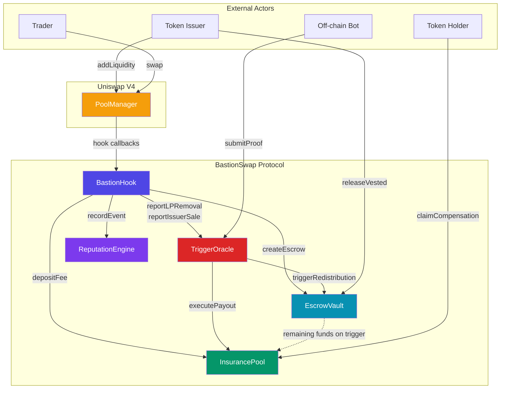

# BastionSwap: Escrow-Native DEX Protocol

[](LICENSE)
[](https://soliditylang.org/)
[](https://book.getfoundry.sh/)

BastionSwap is a **Uniswap V4 Hook-based** decentralized exchange protocol that protects traders from rug-pulls and token exploits through **mandatory escrow vesting**, **on-chain trigger detection**, and **per-token insurance pools**.

When a token issuer creates a liquidity pool, their LP tokens are automatically locked in a time-vested escrow. If malicious behavior is detected — rug-pull, issuer dump, honeypot, hidden tax — the escrow funds are redistributed to an insurance pool from which affected token holders can claim pro-rata compensation.

## Architecture



### Contract Roles

| Contract | Role |
|---|---|
| **BastionHook** | V4 Hook entry point. Intercepts `beforeAddLiquidity`, `beforeRemoveLiquidity`, and `afterSwap` to orchestrate escrow locking, insurance fee collection, and rug-pull monitoring. |
| **EscrowVault** | Manages time-locked vesting of issuer LP funds with daily withdrawal limits and issuer commitments. Redistributes remaining funds to InsurancePool on trigger. |
| **InsurancePool** | Collects swap fees on buy-side trades and distributes pro-rata compensation to holders when a trigger fires. 30-day claim window. |
| **TriggerOracle** | Detects 6 types of malicious behavior on-chain (rug-pull, issuer dump, honeypot, hidden tax, slow rug, commitment breach) with a 1-hour grace period before execution. |
| **ReputationEngine** | Computes informational reputation scores (0–1000) for token issuers based on on-chain history. Non-blocking — never prevents transactions. |

### Trigger Types

| Type | Detection | Default Threshold |
|---|---|---|
| RUG_PULL | On-chain: single LP removal | >50% of total LP |
| ISSUER_DUMP | On-chain: cumulative issuer sales | >30% of supply in 24h |
| HONEYPOT | Off-chain: bot proof submission | Proof-based |
| HIDDEN_TAX | Off-chain: swap output deviation | >5% deviation |
| SLOW_RUG | On-chain: cumulative LP drain | >80% in window |
| COMMITMENT_BREACH | On-chain: constraint violation | Direct trigger |

## Quick Start

### Prerequisites

- [Foundry](https://book.getfoundry.sh/getting-started/installation) (forge, cast, anvil)
- Git

### Build

```bash
git clone https://github.com/bastion-swap/bastion-swap.git
cd bastion-swap
forge install
make build
```

### Test

```bash
make test          # Run all tests (unit + integration + invariant)
make test-gas      # Run tests with gas report
```

### Deploy

1. Copy `.env.example` to `.env` and configure:
   ```
   DEPLOYER_PRIVATE_KEY=0x...
   BASE_SEPOLIA_RPC=https://sepolia.base.org
   ETHERSCAN_API_KEY=...
   ```

2. Dry-run (local simulation):
   ```bash
   make deploy-testnet-dry
   ```

3. Deploy to Base Sepolia:
   ```bash
   make deploy-testnet
   ```

4. Deploy to Base Mainnet:
   ```bash
   make deploy-mainnet
   ```

Deployment output is written to `deployments/{chainId}.json`.

## Contract Addresses

### Base Sepolia Testnet (Chain ID: 84532)

| Contract | Address |
|---|---|
| BastionHook | _TBD after deployment_ |
| EscrowVault | _TBD after deployment_ |
| InsurancePool | _TBD after deployment_ |
| TriggerOracle | _TBD after deployment_ |
| ReputationEngine | _TBD after deployment_ |

### External Dependencies

| Contract | Network | Address |
|---|---|---|
| Uniswap V4 PoolManager | Base Sepolia | `0x05E73354cFDd6745C338b50BcFDfA3Aa6fA03408` |
| Uniswap V4 PoolManager | Base Mainnet | `0x498581fF718922c3f8e6A244956aF099B2652b2b` |
| Permit2 | All chains | `0x000000000022D473030F116dDEE9F6B43aC78BA3` |
| WETH | Base | `0x4200000000000000000000000000000000000006` |

## Project Structure

```
src/
  hooks/
    BastionHook.sol          # Uniswap V4 Hook (entry point)
  core/
    EscrowVault.sol          # Time-locked vesting management
    InsurancePool.sol        # Per-token insurance fund
    TriggerOracle.sol        # On-chain rug-pull detection
    ReputationEngine.sol     # Issuer reputation scoring
  interfaces/                # Contract interfaces (IEscrowVault, IInsurancePool, etc.)
script/
  Deploy.s.sol               # Production deployment script
  BastionDeployer.sol        # CREATE2 deployer factory
  HookMiner.sol              # Hook address salt miner
test/
  unit/                      # Unit tests per contract
  integration/               # Integration & E2E scenario tests
  invariant/                 # Invariant/fuzz tests
docs/
  ARCHITECTURE.md            # Detailed architecture documentation
  SECURITY.md                # Security considerations & audit checklist
```

## Documentation

- **[Architecture](docs/ARCHITECTURE.md)** — Detailed protocol design, contract interactions, trigger mechanisms, and deployment strategy
- **[Security](docs/SECURITY.md)** — Threat model, known attack vectors, mitigations, and audit checklist

## Tech Stack

- **Solidity** 0.8.26 (EVM target: Cancun)
- **Foundry** (Forge, Cast, Anvil)
- **Uniswap V4** (v4-core, v4-periphery)
- **OpenZeppelin** (ReentrancyGuard via v4-core)
- **Target Chains**: Base (primary), Arbitrum, Optimism

## License

Licensed under the [Business Source License 1.1](LICENSE) (BUSL-1.1).

- **Licensed Work**: BastionSwap Protocol
- **Change Date**: March 4, 2030
- **Change License**: GPL-2.0-or-later

See [LICENSE](LICENSE) for full terms.
