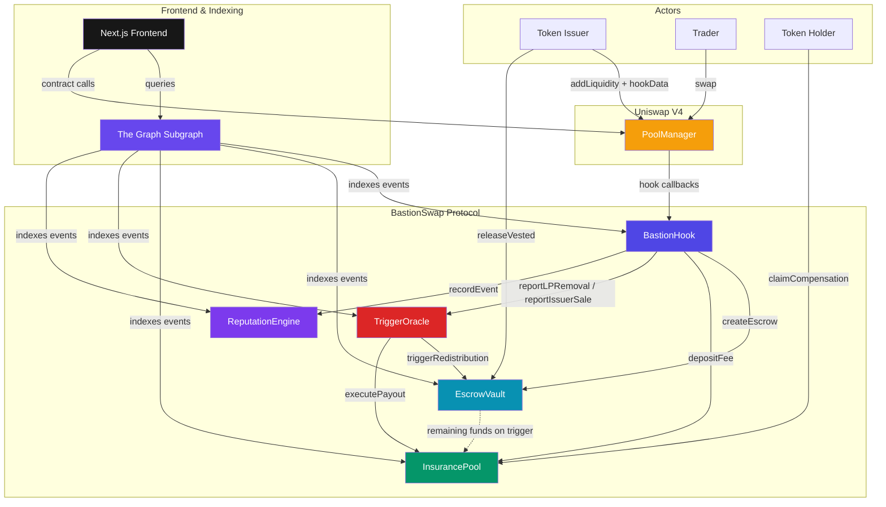

# BastionSwap: Escrow-Native DEX Protocol

[](LICENSE)
[](https://soliditylang.org/)
[](https://book.getfoundry.sh/)
[](https://sepolia.basescan.org)

BastionSwap is a **Uniswap V4 Hook-based** decentralized exchange protocol that protects traders from rug-pulls and token exploits through **mandatory escrow vesting**, **on-chain trigger detection**, and **per-token insurance pools**.

When a token issuer creates a liquidity pool, their LP tokens are automatically locked in a time-vested escrow. If malicious behavior is detected — rug-pull, issuer dump, honeypot, hidden tax — the escrow funds are redistributed to an insurance pool from which affected token holders can claim pro-rata compensation.

## Live Demo (Base Sepolia)

> **[bastionswap-frontend.vercel.app](https://bastionswap-frontend.vercel.app/)** — Try it now on Base Sepolia testnet

| Resource | Link |
|----------|------|
| Frontend | [bastionswap-frontend.vercel.app](https://bastionswap-frontend.vercel.app/) |
| Subgraph Studio | [thegraph.com/studio/subgraph/bastionswap-base-sepolia](https://thegraph.com/studio/subgraph/bastionswap-base-sepolia/) |
| Subgraph API | [GraphQL Playground](https://api.studio.thegraph.com/query/1724500/bastionswap-base-sepolia/version/latest) |
| Block Explorer | [BaseScan (Sepolia)](https://sepolia.basescan.org) |

## Contract Addresses (Base Sepolia)

All contracts are deployed on Base Sepolia (v4 — split routers for EIP-170 compliance).

| Contract | Address |
|----------|---------|
| BastionHook | [`0x3E1fb370C3C38Ed972566E2eaF6fbBe6E9b44AC8`](https://sepolia.basescan.org/address/0x3E1fb370C3C38Ed972566E2eaF6fbBe6E9b44AC8) |
| BastionSwapRouter | [`0x796E0773c5fe19c0C650abF1bAE5d2AEd995dA78`](https://sepolia.basescan.org/address/0x796E0773c5fe19c0C650abF1bAE5d2AEd995dA78) |
| BastionPositionRouter | [`0x6c195167000Be5ADbA07A4D43e68ba1D3a7C269b`](https://sepolia.basescan.org/address/0x6c195167000Be5ADbA07A4D43e68ba1D3a7C269b) |
| EscrowVault | [`0x477e57e4c276D9E974c813Ba5c98C09a6CF8dB16`](https://sepolia.basescan.org/address/0x477e57e4c276D9E974c813Ba5c98C09a6CF8dB16) |
| InsurancePool | [`0x2f811557dCFFBa313c9E01b9aDBF55F3D0AB1540`](https://sepolia.basescan.org/address/0x2f811557dCFFBa313c9E01b9aDBF55F3D0AB1540) |
| TriggerOracle | [`0x6DA43Ee5ba896D2e20d47Ff0E62Fa24C6eb9025b`](https://sepolia.basescan.org/address/0x6DA43Ee5ba896D2e20d47Ff0E62Fa24C6eb9025b) |
| ReputationEngine | [`0xB6E7B03AE5161c9FD482e0f8156C8161601FaE3d`](https://sepolia.basescan.org/address/0xB6E7B03AE5161c9FD482e0f8156C8161601FaE3d) |

**External Dependencies:**

| Contract | Address |
|----------|---------|
| Uniswap V4 PoolManager | `0x05E73354cFDd6745C338b50BcFDfA3Aa6fA03408` |
| WETH (Base) | `0x4200000000000000000000000000000000000006` |
| Permit2 | `0x000000000022D473030F116dDEE9F6B43aC78BA3` |

## Architecture



### Contract Roles

| Contract | Role |
|----------|------|
| **BastionHook** | V4 Hook entry point. Intercepts `beforeAddLiquidity`, `beforeRemoveLiquidity`, and `afterSwap` to orchestrate escrow locking, insurance fee collection, and rug-pull monitoring. |
| **EscrowVault** | Manages time-locked vesting of issuer LP funds with daily withdrawal limits and issuer commitments. Redistributes remaining funds to InsurancePool on trigger. |
| **InsurancePool** | Collects swap fees on buy-side trades and distributes pro-rata compensation to holders when a trigger fires. 30-day claim window. |
| **TriggerOracle** | Detects 6 types of malicious behavior on-chain with a 1-hour grace period before execution. |
| **ReputationEngine** | Computes informational reputation scores (0-1000) for token issuers based on on-chain history. Non-blocking. |

### Trigger Types

| Type | Detection | Default Threshold |
|------|-----------|-------------------|
| RUG_PULL | On-chain: single LP removal | >50% of total LP |
| ISSUER_DUMP | On-chain: cumulative issuer sales | >30% of supply in 24h |
| HONEYPOT | Off-chain: bot proof submission | Proof-based |
| HIDDEN_TAX | Off-chain: swap output deviation | >5% deviation |
| SLOW_RUG | On-chain: cumulative LP drain | >80% in window |
| COMMITMENT_BREACH | On-chain: constraint violation | Direct trigger |

## Quick Start

### Prerequisites

- [Node.js](https://nodejs.org/) >= 18
- [pnpm](https://pnpm.io/) >= 8
- [Foundry](https://book.getfoundry.sh/getting-started/installation) (forge, cast, anvil)

### Install

```bash
git clone https://github.com/your-username/bastionswap.git
cd bastionswap
pnpm install
```

### Build & Test (Contracts)

```bash
cd packages/contracts
forge build
forge test -vvv                          # 285 tests, all passing
FOUNDRY_PROFILE=deploy forge build --sizes  # All contracts < 24KB
```

### Run Frontend Locally

```bash
cd packages/frontend
cp .env.local.example .env.local  # or create manually
pnpm dev                          # http://localhost:3000
```

### Build Subgraph

```bash
cd packages/subgraph
pnpm codegen
pnpm build
```

### Deploy Contracts

```bash
cd packages/contracts
cp .env.example .env  # Fill in DEPLOYER_PRIVATE_KEY, BASE_SEPOLIA_RPC, ETHERSCAN_API_KEY
make deploy-testnet-dry   # Simulation
make deploy-testnet       # Broadcast + verify
```

Deployment output: `deployments/{chainId}.json`

## Project Structure

```
bastionswap/
├── packages/
│   ├── contracts/              # Foundry smart contracts
│   │   ├── src/
│   │   │   ├── hooks/BastionHook.sol
│   │   │   ├── core/           # EscrowVault, InsurancePool, TriggerOracle, ReputationEngine
│   │   │   └── interfaces/     # Contract interfaces
│   │   ├── test/
│   │   │   ├── unit/           # Unit tests per contract
│   │   │   ├── integration/    # Integration & E2E scenario tests
│   │   │   └── invariant/      # Invariant/fuzz tests (10k runs, depth 50)
│   │   ├── script/             # Deploy.s.sol, E2ESimulation.s.sol
│   │   └── deployments/        # Chain-specific deployment records
│   │
│   ├── subgraph/               # The Graph protocol indexer
│   │   ├── schema.graphql      # Entity definitions
│   │   ├── subgraph.yaml       # Data source config
│   │   └── src/mappings/       # Event handlers (5 data sources)
│   │
│   └── frontend/               # Next.js 14 web application
│       ├── src/app/            # Pages: home, swap, create, pools, pool detail
│       ├── src/hooks/          # wagmi + subgraph custom hooks
│       ├── src/components/     # UI components (escrow, insurance, issuer, triggers)
│       └── src/config/         # Contracts, ABIs, wagmi, subgraph config
│
├── docs/
│   ├── ARCHITECTURE.md         # Protocol design & contract interactions
│   └── SECURITY.md             # Threat model & audit checklist
│
├── pnpm-workspace.yaml
└── turbo.json
```

## Tech Stack

| Layer | Technology |
|-------|------------|
| Smart Contracts | Solidity 0.8.26, Foundry, Uniswap V4 |
| Indexing | The Graph (Subgraph Studio) |
| Frontend | Next.js 14, React 18, TypeScript |
| Wallet | wagmi v2, ConnectKit, viem |
| Styling | Tailwind CSS (custom dark theme) |
| Data Fetching | graphql-request, @tanstack/react-query |
| Target Chain | Base (EVM Cancun) |

## Vercel Deployment

1. Import the GitHub repo on [vercel.com](https://vercel.com)
2. Configure:
   - **Root Directory**: `packages/frontend`
   - **Framework Preset**: Next.js
   - **Build Command**: `pnpm build`
3. Set environment variables:
   ```
   NEXT_PUBLIC_SUBGRAPH_URL=https://api.studio.thegraph.com/query/1724500/bastionswap-base-sepolia/version/latest
   NEXT_PUBLIC_CHAIN_ID=84532
   NEXT_PUBLIC_WC_PROJECT_ID=<your-walletconnect-project-id>
   ```
4. Deploy

## Documentation

- **[Architecture](docs/ARCHITECTURE.md)** — Protocol design, contract interactions, trigger mechanisms, deployment strategy
- **[Security](docs/SECURITY.md)** — Threat model, 12 known attack vectors, mitigations, audit checklist

## License

Licensed under the [Business Source License 1.1](LICENSE) (BUSL-1.1).

- **Licensed Work**: BastionSwap Protocol
- **Change Date**: March 4, 2030
- **Change License**: GPL-2.0-or-later
