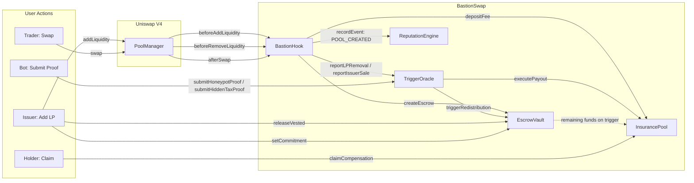
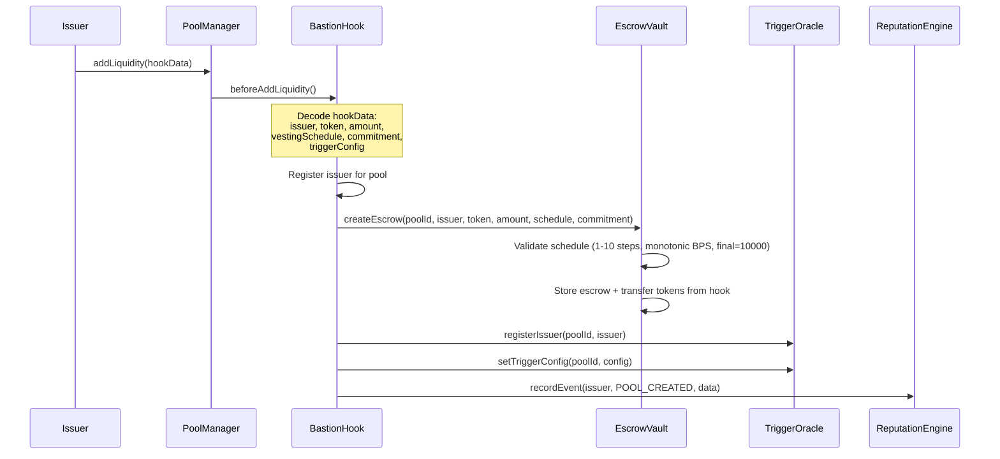
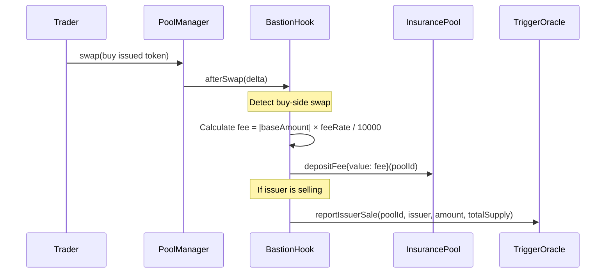
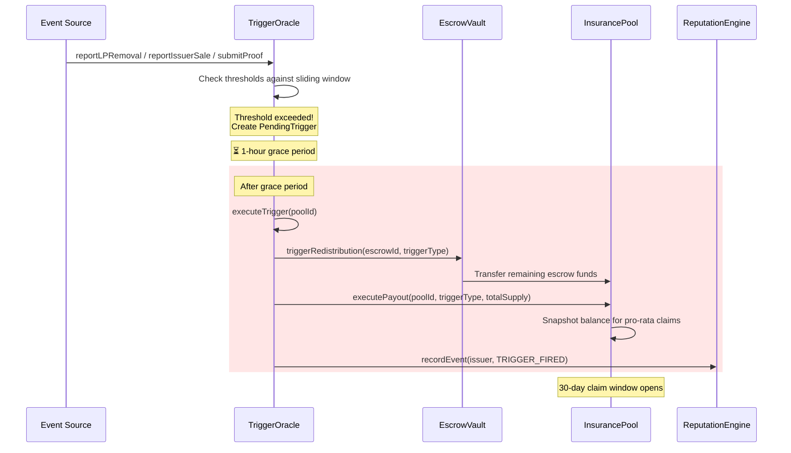
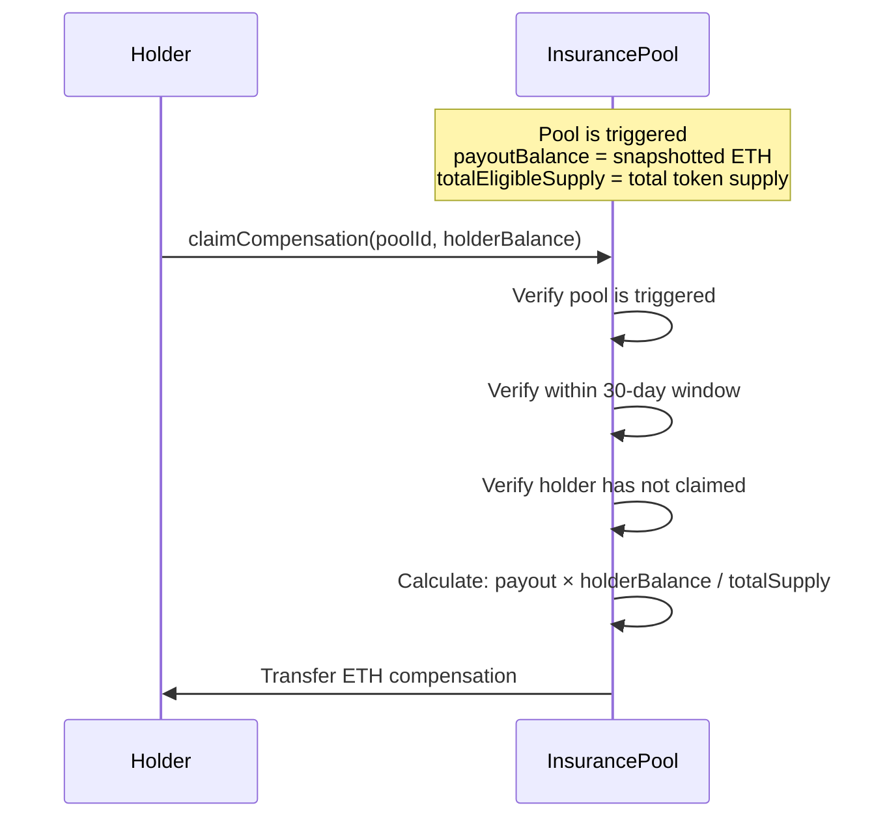
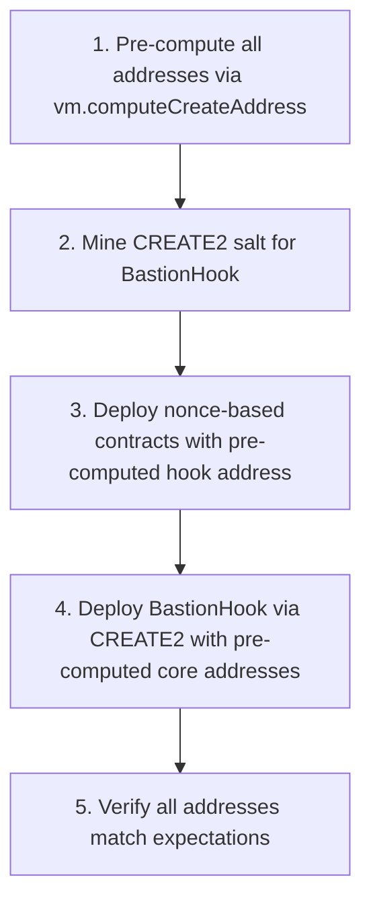

# BastionSwap Architecture

## Overview

BastionSwap is an escrow-native DEX protocol built as a **Uniswap V4 Hook**. It intercepts pool lifecycle events to enforce **issuer accountability** through mandatory escrow vesting, and provides **trader protection** through automated rug-pull detection and insurance compensation.

All access control is enforced via **immutable constructor parameters** — there are no owner-upgradeable proxy patterns or mutable admin roles (except governance fee rate adjustment and guardian pause).

## System Architecture



### Cross-Contract Reference Map

```
BastionHook   → EscrowVault, InsurancePool, TriggerOracle (+ PoolManager)
EscrowVault   → BastionHook, TriggerOracle, InsurancePool
InsurancePool → BastionHook, TriggerOracle, Governance
TriggerOracle → BastionHook, EscrowVault, InsurancePool, Guardian
ReputationEngine → BastionHook, EscrowVault, TriggerOracle
```

All references are **immutable** — set at deployment and cannot be changed.

## Contract Interactions

### 1. Pool Initialization Flow

When a token issuer creates a pool and provides the first liquidity:



**hookData encoding:**
```solidity
abi.encode(
    address issuer,
    address token,
    uint256 amount,
    VestingStep[] vestingSchedule,
    IssuerCommitment commitment,
    TriggerConfig triggerConfig
)
```

The first LP provider is automatically registered as the **issuer** for that pool. Subsequent LP adds do not create new escrows.

### 2. Normal Trading Flow



Insurance fees are collected on **buy-side swaps only** (when the trader receives the issued token). The default fee rate is **1% (100 BPS)**, adjustable by governance up to **2% (200 BPS)**.

### 3. Vesting & Release Flow

```
Escrow Creation                    Vesting Timeline
     │                                  │
     ▼                                  ▼
┌─────────┐    lockDuration     ┌──────────────────────────────────┐
│ Locked   │◄──────────────────►│  Vesting Steps                   │
│ (no      │                    │                                  │
│ release) │                    │  Step 1:  30d → 25% unlocked     │
└─────────┘                    │  Step 2:  90d → 50% unlocked     │
                                │  Step 3: 180d → 75% unlocked     │
                                │  Step 4: 365d → 100% unlocked    │
                                └──────────────────────────────────┘
                                         │
                                         ▼
                                ┌──────────────────────────────────┐
                                │  Per-Day Release                  │
                                │  max = totalAmount × dailyLimit  │
                                │           / 10000                 │
                                └──────────────────────────────────┘
```

**Constraints enforced:**
- **Lock Duration**: No tokens released until `lockDuration` seconds pass after escrow creation
- **Vesting Schedule**: Up to 10 steps, each with `timeOffset` (seconds after lock expires) and cumulative `basisPoints` (0–10000)
- **Daily Withdrawal Limit**: Maximum percentage of total amount withdrawable per calendar day (`dailyWithdrawLimit` BPS)
- **Commitment Ratchet**: Issuer can only make commitments stricter (lower daily limit, longer lock, lower sell percent) via `setCommitment()`

### 4. Trigger Detection & Execution Flow



### 5. Compensation Claim Flow

After trigger execution, affected token holders can claim compensation:



## Trigger Mechanism Detail

### Trigger Types

| Type | ID | Detection Method | Default Threshold |
|---|---|---|---|
| **RUG_PULL** | 1 | Single LP removal exceeds threshold | 50% of total LP |
| **ISSUER_DUMP** | 2 | Cumulative issuer sales in time window | 30% of supply in 24h |
| **HONEYPOT** | 3 | Off-chain bot proof: token blocks transfers | Proof-based |
| **HIDDEN_TAX** | 4 | Swap output deviates from expected | >5% deviation |
| **SLOW_RUG** | 5 | Cumulative LP drain in time window | 80% in configured window |
| **COMMITMENT_BREACH** | 6 | Issuer violates on-chain constraints | Direct trigger |

### On-Chain vs Off-Chain Detection

**On-chain (real-time, via BastionHook callbacks):**
- `RUG_PULL` — Detected in `beforeRemoveLiquidity` via `reportLPRemoval()`
- `ISSUER_DUMP` — Detected in `afterSwap` via `reportIssuerSale()`
- `SLOW_RUG` — Cumulative LP removal tracking with sliding window
- `COMMITMENT_BREACH` — Direct report from hook via `reportCommitmentBreach()`

**Off-chain (bot-submitted proofs):**
- `HONEYPOT` — External bot submits proof via `submitHoneypotProof()`
- `HIDDEN_TAX` — External bot submits expected vs actual output via `submitHiddenTaxProof()`

### Sliding Window Implementation

LP removals and issuer sales are tracked in a sliding window array (max 50 entries per pool). The `_sumWindow()` function aggregates amounts within the configured time window:

```
Time ──────────────────────────────────────────────────────►
       │    │     │        │   │                          │
       R1   R2    R3       R4  R5                     Current
       ◄────── dumpWindowSeconds (default: 86400s) ───────►

Sum = R3.amount + R4.amount + R5.amount    (R1, R2 outside window — excluded)
```

**Key properties:**
- Max 50 entries per pool to prevent unbounded gas costs
- `_pushRecord()` prunes oldest entries when limit reached (array shift)
- Only entries within `dumpWindowSeconds` contribute to the cumulative sum
- Both single-transaction and cumulative thresholds are checked

### Grace Period

All triggers enter a **1-hour grace period** before execution. This serves to:
- Prevent false positives from temporary market conditions
- Allow time for legitimate explanations or counter-evidence
- Enable permissionless execution — **anyone** can call `executeTrigger()` after the grace period
- Prevent MEV-based front-running of trigger execution

### Protocol Constants

| Component | Constant | Value | Purpose |
|-----------|----------|-------|---------|
| TriggerOracle | `GRACE_PERIOD` | 1 hour | Time before trigger execution |
| TriggerOracle | `MAX_TRACKER_ENTRIES` | 50 | Sliding window max size |
| InsurancePool | `CLAIM_PERIOD` | 30 days | Compensation claim window |
| InsurancePool | `MAX_FEE_RATE` | 200 BPS (2%) | Maximum insurance fee |
| InsurancePool | Default `feeRate` | 100 BPS (1%) | Default insurance fee |
| EscrowVault | `MAX_SCHEDULE_LENGTH` | 10 | Max vesting steps |
| ReputationEngine | `BASELINE_SCORE` | 100 | Starting score for new issuers |

## Reputation Engine

The ReputationEngine computes **non-blocking** scores (0–1000) based on on-chain history:

| Component | Max Points | Source |
|---|---|---|
| Vesting completion rate | 300 | completedEscrows / totalPools |
| Escrow history (value-weighted) | 200 | totalLockedWeighted / 1,000,000 scale |
| Commitment strictness | 200 | Average strictness across commitments |
| Wallet age | 100 | Time since first event (~1 year for max) |
| Token diversity | 200 | Unique tokens used (5 tokens for max) |
| Trigger penalty | -500 | -100 per severe trigger (RUG_PULL/DUMP), -50 per other |

Scores are **informational only** and never block transactions. They can be encoded via `encodeScoreData()` for potential cross-chain transmission.

### Event Types

| Event | Source | Effect |
|---|---|---|
| `POOL_CREATED` | BastionHook | +diversity, +strictness score |
| `ESCROW_COMPLETED` | EscrowVault | +completion rate |
| `TRIGGER_FIRED` | TriggerOracle | -100 or -50 penalty |
| `COMMITMENT_HONORED` | EscrowVault | +strictness score |
| `COMMITMENT_VIOLATED` | TriggerOracle | -penalty |

## Deployment Architecture

### Circular Dependency Resolution

All five contracts reference each other via immutable constructor parameters:

```
BastionHook   → EscrowVault, InsurancePool, TriggerOracle
EscrowVault   → BastionHook, TriggerOracle, InsurancePool
InsurancePool → BastionHook, TriggerOracle
TriggerOracle → BastionHook, EscrowVault, InsurancePool
ReputationEngine → BastionHook, EscrowVault, TriggerOracle
```

This is resolved at deployment via **nonce-based address pre-computation**:



1. **Pre-compute** all contract addresses using `vm.computeCreateAddress(deployer, nonce)`
2. **Mine** a CREATE2 salt for BastionHook so its address matches V4 hook flag pattern (`0x0A40` = BEFORE_ADD_LIQUIDITY | BEFORE_REMOVE_LIQUIDITY | AFTER_SWAP)
3. **Deploy** core contracts (EscrowVault, InsurancePool, TriggerOracle, ReputationEngine) with the pre-computed hook address
4. **Deploy** BastionHook via CREATE2 with the pre-computed core contract addresses
5. **Verify** all deployed addresses match pre-computed addresses

See `script/Deploy.s.sol` for the full implementation, `script/BastionDeployer.sol` for the CREATE2 factory, and `script/HookMiner.sol` for the salt mining utility.

## Security Model

All access control is **immutable** — set once at deployment and enforced via `require(msg.sender == IMMUTABLE_ADDRESS)`. There are only two mutable admin capabilities:

1. **Governance** (InsurancePool): Can adjust fee rate (capped at 2%) and execute emergency withdrawals
2. **Guardian** (TriggerOracle): Can pause/unpause trigger detection and execution

No contract is upgradeable. No proxy patterns are used. See [SECURITY.md](SECURITY.md) for detailed threat model and attack vector analysis.
