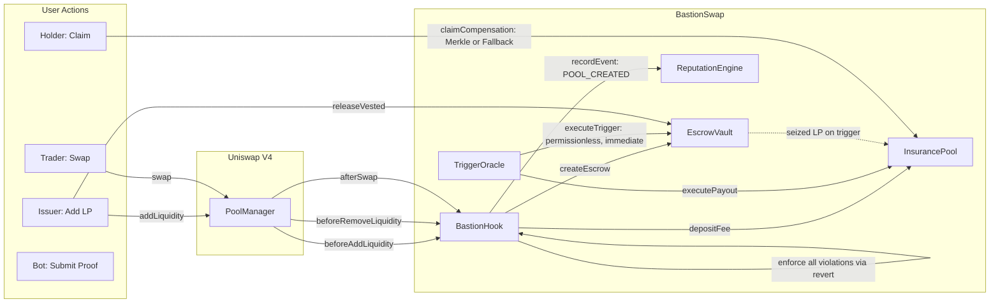
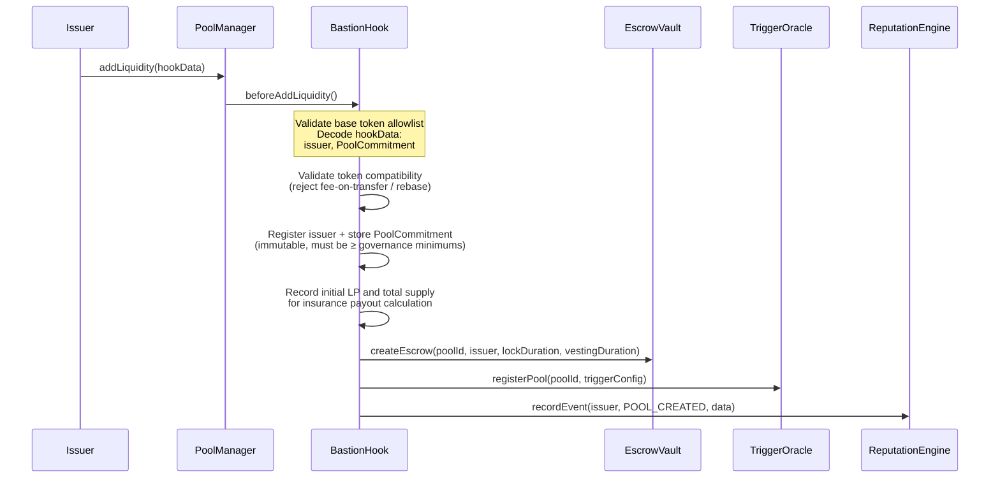
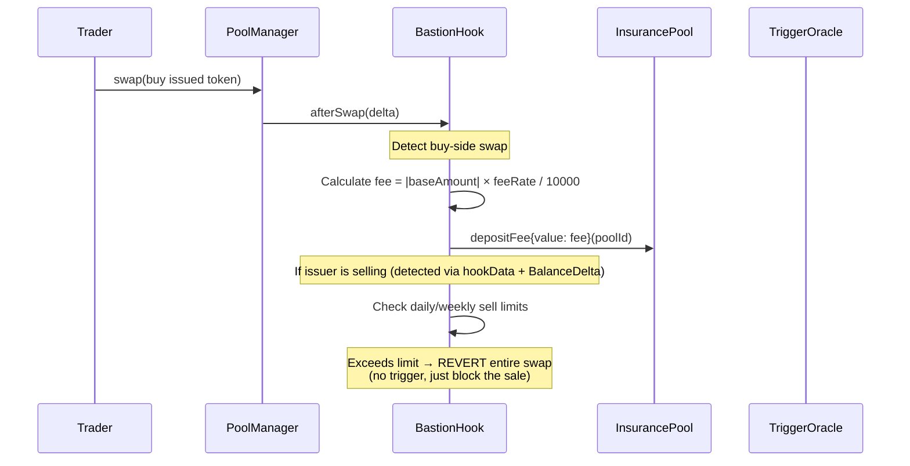
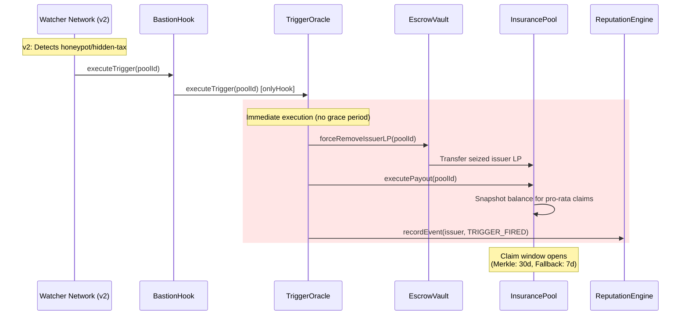
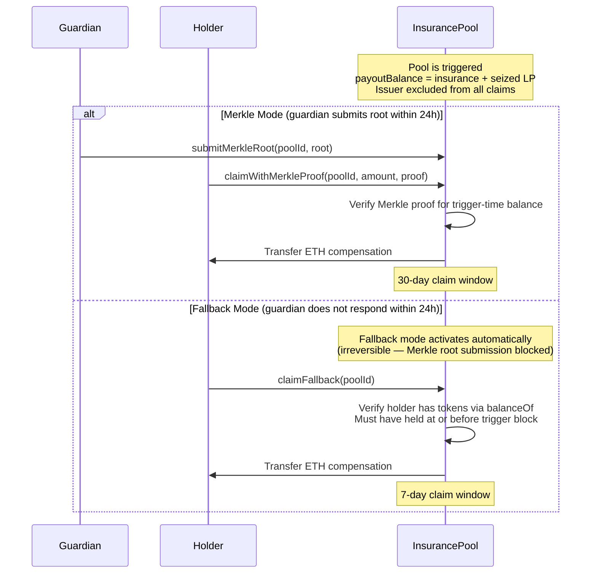
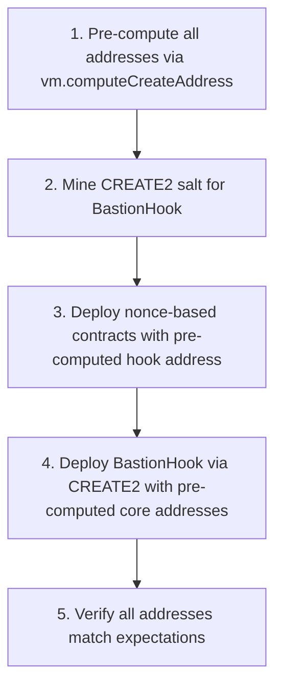

# BastionSwap Architecture

## Overview

BastionSwap is an escrow-native DEX protocol built as a **Uniswap V4 Hook**. It intercepts pool lifecycle events to enforce **issuer accountability** through mandatory escrow vesting, and provides **trader protection** through automated rug-pull detection and insurance compensation.

Access control uses a combination of **immutable constructor parameters** and **storage-based governance**. Cross-contract references are immutable. Governance address is stored (transferable) and controls protocol-wide parameters. There are no upgradeable proxy patterns.

## System Architecture



### Cross-Contract Reference Map

```
BastionHook   → EscrowVault, InsurancePool, TriggerOracle (+ PoolManager)
EscrowVault   → BastionHook, TriggerOracle, InsurancePool
InsurancePool → BastionHook, TriggerOracle, Governance
TriggerOracle → BastionHook, EscrowVault, InsurancePool, Guardian
ReputationEngine → BastionHook, EscrowVault, TriggerOracle
```

Cross-contract references are **immutable** — set at deployment and cannot be changed. Governance address is storage-based and transferable via `transferGovernance()` in BastionHook, InsurancePool, and TriggerOracle.

## Contract Interactions

### 1. Pool Initialization Flow

When a token issuer creates a pool and provides the first liquidity:



**PoolCommitment struct** (immutable per pool, set at creation):
- `lockDuration`, `vestingDuration` — lock-up + linear vesting schedule
- `maxDailyLpRemovalBps`, `maxWeeklyLpRemovalBps` — daily/weekly LP removal limits
- `maxDailySellBps`, `maxWeeklySellBps` — daily/weekly sell limits

The first LP provider is automatically registered as the **issuer** for that pool. Subsequent LP adds do not create new escrows. Both pool tokens are validated — at least one must be a whitelisted base token (ETH, WETH, USDC). If both are base tokens, Bastion protection is skipped.

### 2. Normal Trading Flow



**Issuer sell detection**: Cooperating routers pass `abi.encode(actualSwapper)` in hookData. The hook decodes this to identify whether the swapper is the registered issuer. Sell limits are enforced via `afterSwap` revert — if the issuer's cumulative sales exceed daily (default: 3% of current pool reserve per 24h) or weekly (default: 15% per 7d) limits, the entire transaction reverts. The denominator is the issued token's current balance in PoolManager, which dynamically tightens limits as the pool shrinks from sells. This blocks sales via any path including routers and aggregators.

Insurance fees are collected on **buy-side swaps only** (when the trader receives the issued token). The default fee rate is **1% (100 BPS)**, adjustable by governance within **0.1%–5% (10–500 BPS)**.

### 3. Vesting & Release Flow

```
Escrow Creation          Lock-up Period              Linear Vesting
     │                        │                           │
     ▼                        ▼                           ▼
┌─────────┐    lockDuration     ┌────────────────────────────────┐
│ Locked   │◄──────────────────►│  Linear Vesting                 │
│ (no      │  (default: 7d)     │  (default: 83d)                 │
│ release) │                    │                                 │
└─────────┘                    │  vestedAmount = totalLP ×        │
                                │    (elapsed - lockDuration)      │
                                │    / vestingDuration             │
                                │                                 │
                                │  Day 0:   0% unlocked           │
                                │  Day 42: ~50% unlocked          │
                                │  Day 83: 100% unlocked          │
                                └────────────────────────────────┘
```

**Constraints enforced:**
- **Lock Duration**: No LP removal until `lockDuration` seconds pass after escrow creation (default: 7 days, min: 7 days)
- **Linear Vesting**: After lock expires, LP unlocks linearly over `vestingDuration` (default: 83 days, min: 7 days)
- **Daily LP Removal Limit**: Max LP removable within a 24h rolling window (default: 10% of initial LP, per PoolCommitment)
- **Weekly LP Removal Limit**: Max LP removable within a 7-day rolling window (default: 30% of initial LP, per PoolCommitment)
- **Immutable Commitments**: Per-pool parameters set at creation, cannot be changed afterward

### 4. Violation Enforcement (v1)

BastionSwap v1 uses **revert-only enforcement** for all issuer violations. Every violation — sell limits, daily LP removal, and weekly LP removal — is blocked by reverting the transaction in BastionHook. No trigger is fired.

```
Issuer attempts violation
    │
    ├── Sell exceeds daily/weekly limit → afterSwap REVERT
    ├── Daily LP removal > threshold → beforeRemoveLiquidity REVERT
    └── Weekly LP removal > threshold → beforeRemoveLiquidity REVERT
```

### 4b. Trigger Infrastructure (Preserved for v2)

The trigger-based LP seizure flow is preserved for v2 watcher network integration. The `executeTrigger()` interface, TriggerOracle, and InsurancePool compensation mechanisms remain functional.



### 5. Compensation Claim Flow

After trigger execution, affected non-issuer token holders can claim compensation via one of two mutually exclusive modes:



**Normal completion** (no trigger, vesting fully elapsed): 10% of insurance pool to issuer as vesting reward, 90% to protocol treasury.

## Protection Mechanism Detail (v1)

### Revert-Only Enforcement

All violations are blocked by reverting the transaction. No trigger is fired — the issuer simply cannot complete the action.

| Protection | Hook | Default Limit | Error |
|-----------|------|---------------|-------|
| **Daily LP removal** | `beforeRemoveLiquidity` revert | >10% of initial LP per 24h | `DailyLpRemovalExceeded` |
| **Weekly LP removal** | `beforeRemoveLiquidity` revert | >30% of initial LP per 7d | `WeeklyLpRemovalExceeded` |
| **Daily sell limit** | `afterSwap` revert | >3% of current pool reserve per 24h | `IssuerDailySellExceeded` |
| **Weekly sell limit** | `afterSwap` revert | >15% of current pool reserve per 7d | `IssuerWeeklySellExceeded` |
| **Vesting enforcement** | `beforeRemoveLiquidity` revert | Based on lock-up + linear vesting | — |
| **Token compatibility** | Pool creation revert | Fee-on-transfer / rebase tokens rejected | — |

**Issuer sell detection**: The hook identifies issuers via `hookData` — cooperating routers (BastionSwapRouter) encode `abi.encode(actualSwapper)`. The hook uses V4 `BalanceDelta` (negative = user sends tokens) to detect sell direction. Epoch-based daily/weekly sliding windows track cumulative sales.

### LP Removal Tracking

LP removals are tracked using `_dailyLpRemoved`/`_dailyLpWindowStart` and `_weeklyLpRemoved`/`_weeklyLpWindowStart` mappings per pool. The denominator for BPS calculations is `_initialLiquidity` (set at pool creation). Both daily and weekly window checks are enforced in `beforeRemoveLiquidity` using ceil-division BPS — if either threshold is breached, the transaction reverts and the state change rolls back. Windows reset automatically when the time period elapses.

### Planned (v2 — Trigger-based LP Seizure)

The trigger infrastructure (`executeTrigger()`, `forceRemoveIssuerLP`, InsurancePool compensation) is preserved for v2. When a decentralized watcher network is deployed, cumulative LP removal enforcement will upgrade from revert-only to trigger-based LP seizure + compensation.

| Trigger | Detection | Notes |
|---------|-----------|-------|
| **Honeypot** | Decentralized watcher network: transfer() revert detection | Requires off-chain infrastructure |
| **Hidden Tax** | Decentralized watcher network: swap output deviation >5% | Requires off-chain infrastructure |
| **Excessive LP removal** | Watcher network confirms on-chain threshold breach | Upgrades from revert to LP seizure + compensation |

### Protocol Constants & Governance Defaults

| Component | Parameter | Default Value | Purpose |
|-----------|----------|-------|---------|
| TriggerOracle | `maxPauseDuration` | 7 days | Max guardian pause duration |
| InsurancePool | `merkleClaimPeriod` | 30 days | Merkle proof claim window |
| InsurancePool | `fallbackClaimPeriod` | 7 days | Fallback balanceOf claim window |
| InsurancePool | `emergencyTimelock` | 2 days | Emergency withdrawal delay |
| InsurancePool | `issuerRewardBps` | 1000 (10%) | Issuer vesting completion reward |
| InsurancePool | `merkleSubmissionDeadline` | 24 hours (6h–72h) | Guardian deadline for Merkle root |
| InsurancePool | Fee range | 10–500 BPS (0.1%–5%) | Governance-adjustable fee bounds |
| InsurancePool | Default `feeRate` | 100 BPS (1%) | Default insurance fee |
| BastionHook | `defaultLockDuration` | 7 days | Default escrow lock-up |
| BastionHook | `defaultVestingDuration` | 83 days | Default linear vesting period |
| BastionHook | `minLockDuration` | 7 days | Minimum allowed lock-up |
| BastionHook | `minVestingDuration` | 7 days | Minimum allowed vesting |
| BastionHook | `maxDailyLpRemovalBps` | 1000 (10%) | Max daily LP removal limit for issuers |
| BastionHook | `maxWeeklyLpRemovalBps` | 3000 (30%) | Max weekly LP removal limit for issuers |
| BastionHook | `maxPoolTVL` | ETH: 2 ether, WETH: 2 ether, USDC: 5000e6 | Per-token base reserve cap (0 = unlimited) |
| EscrowVault | `MIN_LOCK_DURATION` | 7 days | Safety floor (immutable) |
| EscrowVault | `MIN_VESTING_DURATION` | 7 days | Safety floor (immutable) |
| ReputationEngine | `BASELINE_SCORE` | 100 | Starting score for new issuers |

## Reputation Engine

The ReputationEngine computes **non-blocking** scores (0–1000) based on on-chain history:

| Component | Max Points | Source |
|---|---|---|
| Vesting completion rate | 300 | completedEscrows / totalPools |
| Commitment score | 300 | 4-component formula: lock duration + vesting duration + sell limits + LP limits (reads governance params dynamically) |
| Wallet age | 100 | Time since first event (~1 year for max) |
| Token diversity | 200 | Unique tokens used (5 tokens for max) |
| Trigger penalty | -500 | -100 per severe trigger, -50 per other |

Scores are **informational only** and never block transactions. They can be encoded via `encodeScoreData()` for potential cross-chain transmission.

### Event Types

| Event | Source | Effect |
|---|---|---|
| `POOL_CREATED` | BastionHook | +diversity, +strictness score |
| `ESCROW_COMPLETED` | EscrowVault | +completion rate |
| `TRIGGER_FIRED` | TriggerOracle | -100 or -50 penalty |
| `COMMITMENT_HONORED` | EscrowVault | +strictness score |
| `COMMITMENT_VIOLATED` | TriggerOracle | -penalty |

## Deployment Architecture

### Circular Dependency Resolution

All five contracts reference each other via immutable constructor parameters:

```
BastionHook   → EscrowVault, InsurancePool, TriggerOracle
EscrowVault   → BastionHook, TriggerOracle, InsurancePool
InsurancePool → BastionHook, TriggerOracle
TriggerOracle → BastionHook, EscrowVault, InsurancePool
ReputationEngine → BastionHook, EscrowVault, TriggerOracle
```

This is resolved at deployment via **nonce-based address pre-computation**:



1. **Pre-compute** all contract addresses using `vm.computeCreateAddress(deployer, nonce)`
2. **Mine** a CREATE2 salt for BastionHook so its address matches V4 hook flag pattern (BEFORE_ADD_LIQUIDITY | BEFORE_REMOVE_LIQUIDITY | BEFORE_SWAP | AFTER_SWAP)
3. **Deploy** core contracts (EscrowVault, InsurancePool, TriggerOracle, ReputationEngine) with the pre-computed hook address
4. **Deploy** BastionHook via CREATE2 with the pre-computed core contract addresses
5. **Verify** all deployed addresses match pre-computed addresses

See `script/Deploy.s.sol` for the full implementation, `script/BastionDeployer.sol` for the CREATE2 factory, and `script/HookMiner.sol` for the salt mining utility.

## Security Model

Cross-contract references are **immutable** — set at deployment and cannot be changed. Governance address is **storage-based** and transferable via `transferGovernance()` in BastionHook, InsurancePool, and TriggerOracle.

**Governance capabilities** (protocol-wide, affects new pools only):
- Adjust insurance fee rate (within 10–500 BPS range)
- Manage base token whitelist and minimum liquidity requirements
- Set default/minimum lock-up and vesting durations
- Set default LP removal and sell limit thresholds
- Set TriggerOracle config with range validation (BPS 1–10000, time windows bounded)
- Emergency withdrawal from InsurancePool (with 2-day timelock)
- Set TVL cap, treasury address, guardian address, claim periods
- Set issuer vesting reward percentage
- Set Merkle submission deadline (6h–72h)

**Guardian capabilities** (TriggerOracle):
- Pause/unpause trigger detection (max 7-day duration)
- Submit Merkle roots for triggered pool compensation

No contract is upgradeable. No proxy patterns are used. See [SECURITY.md](SECURITY.md) for detailed threat model and attack vector analysis.
